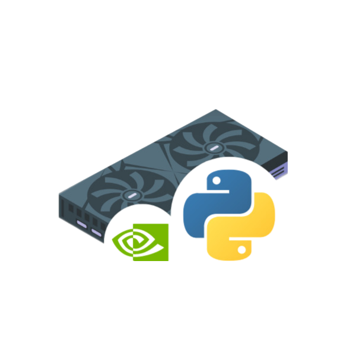

Gpu_CUDA_AES
============

.. raw:: html

   

==============================
**Encypt/Decypt with your Nvidia GPU with AES!**
==============================

`Explore in the documentation » <https://peluqueriamael.com/docs>`_

`Report bug <https://github.com/twbs/bootstrap/issues/new?assignees=-&labels=bug&template=bug_report.yml>`_ · `Request feature <https://github.com/twbs/bootstrap/issues/new?assignees=&labels=feature&template=feature_request.yml>`_ · `Themes <https://themes.getbootstrap.com/>`_

.. image:: https://img.shields.io/pypi/dm/to_literal
  :alt: PyPI - Downloads

.. image:: https://badges.gitter.im/Join%20Chat.svg
  :alt: Gitter

.. raw:: html

   

    
    

Forget to implement in the hard way other code to encrypt with this lib. Avoid to do an implementations to your code!
These are the authors of the code made with CUDA and AES part: (github: aranscha) Alexander Ranschaert

I have a lot of respect for the people who made all this possible, go support them

